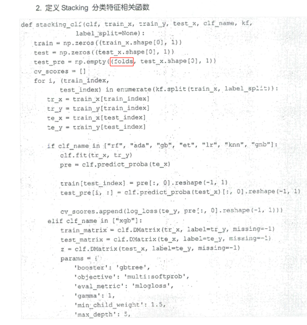
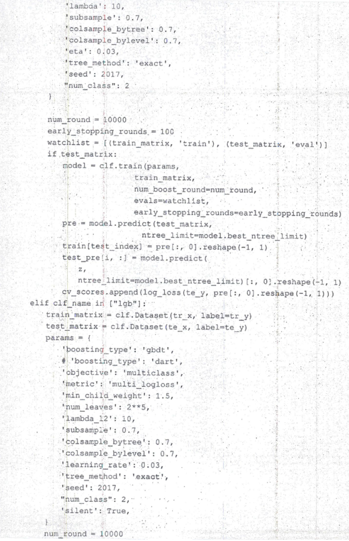
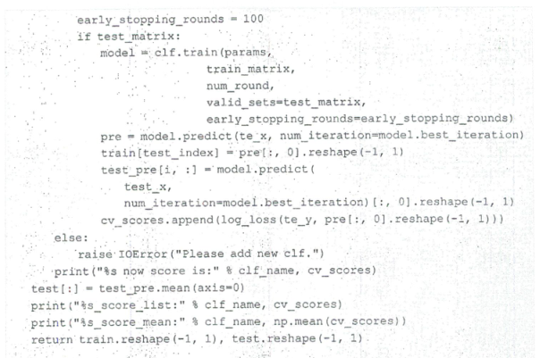
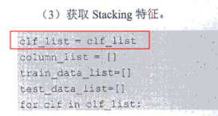

# 快跑！！！！！！

**跟着学到了第3章，发现这本书不值得。**

## 首先，这本书**没有给出**使用的Python的版本，也**没有给出**使用的库的版本，一些代码在新版本中已经无法使用。我们可以自己查找更改，但是会**浪费时间**。

## 其次，书中有很多**明显错误**，包括但不限于在函数中使用未声明的变量、原地赋值等。

## 最后，基本就是纯纯的代码罗列，没有思路讲解（只有简单的注释），不适合这种比赛的入门学习。

我真的很想学习这方面的知识，请路过的大佬尽情指点。

这本书又一次印证了我对国内计算机书籍的刻板印象。

去看国外的教材了，以后非必要不看国内教材了。

## 以下是我已经遇到的部分问题

### 2.2.7 探查影响复购的各种因素 1.对店铺的分析

（1）分析不同店铺与复购的关系，并可视化显示。

原文是

```python
sax = sns.countplot('merchant_id', hue='label', data=train_data_merchant)
```

这里应该改成以下形式。

```python
train_data_merchant['label'] = train_data_merchant['label'].astype(str)
sax = sns.countplot(train_data_merchant, x='merchant_id', hue='label')
```

label只有0和1，而matplotlib期望得到的label series是object/string，而我们传入了一个int64，因此需要先转换成str格式

并且，需要将train_data_merchant位置提前，才能正常画图。

画完图之后，需要将`train_data_merchant['label']`的类型再改成int型，因为后续统计label的时候会把他看成int型的。

### 3.3.9 Stacking分类特征 2.定义Stacking分类特征相关函数

使用了未声明的变量。







### 3.3.9 Stacking分类特征 4.使用lgb和xgb分类模型构造Stacking特征

原地赋值是什么操作？？




